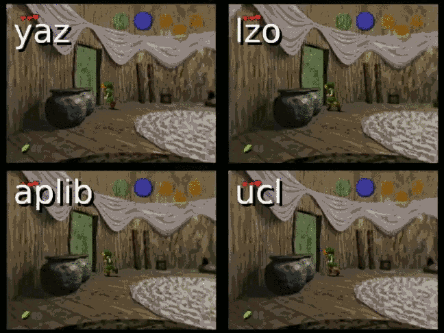

# z64enc

`z64enc` is a collection of patches for customizing OoT and MM's compression codec. The goal of this project is to provide options for Zelda mods that contain too much content to fit in 32 MB when using the game's default codec. `z64enc` was inspired by [`spinout182's z-filenew`](http://www.spinout182.com/?a=z&p=zfsnew).

## Credits

**z64.me** - Programming

**CrookedPoe** - Finding functions, Ghidra magic, hardware testing

**Mikau6** - N64 and Wii VC hardware testing, comparison footage

## Codec comparison chart

OoT NTSC 1.0 was used for these tests. `yaz` is the game's original codec.

| Codec   | Load times | Savings     | Ratio      | Time        | ROM size       |
| ------- | ---------- | ----------- | ---------- | ----------- | -------------- |
| yaz     | 1.00 x     | 0           | 52.54%     | 24.598 s    | 33,092,877     |
| lzo     | 1.35 x     | 1.30 MB     | 49.43%     | 2.180 s     | 31,727,062     |
| ~~ucl~~ | ~~2.09 x~~ | ~~2.35 MB~~ | ~~46.79%~~ | ~~3.927 s~~ | ~~30,625,118~~ |
| aplib   | 1.67 x     | 3.54 MB     | 43.86%     | 8m 4.550s   | 29,383,659     |

#### Key

* **Load times**: In-game load times, as a ratio to `yaz` (lower = better)

* **Savings**: How much space is saved over `yaz` (higher = better)

* **Ratio**: `compressed / original` average across all files in game (lower = better)

* **Time**: How long it takes to compress the rom

* **ROM size**: Size (in bytes) of final compressed rom

* Anything ~~struckthrough~~ is considered obsolete because it has been deemed slower than another codec with a better compression ratio. Don't take this as gospel, as these are merely personal findings. You may find different performance between codecs across emulators, so strive to use whatever best suits your target platform. Because differences in load times are negligible on real N64 hardware, Wii VC was used for these tests.

#### Recommendation

Codecs are ordered such that compression ratio improves at the expense of load times as you walk down the list. If you're having a hard time getting your rom to compress to under 32 MB, start at the beginning and work your way down.

## z64compress integration

Find the appropriate patch for your rom\* in this repo's `patch` folder. You can apply this patch to your rom using [CloudMax's online patcher](https://cloudmodding.com/app/rompatcher). If you're using decomp, grab a codec from the `src` folder and adapt it to work in place of decomp's `src/boot/yaz0.c`.

Now compress your rom using [`z64compress`](https://github.com/z64me/z64compress).

\* If you can't find a codec patch for your rom, your rom is unsupported.

## zzrtl integration

First, you need to compress your rom using [`zzrtl`](http://www.z64.me/tools/zzrtl).

Then, from this repo's `patch` folder, select the same codec you used with `zzrtl`. Find the appropriate patch for your rom\*. You can apply this patch to your rom using [CloudMax's online patcher](https://cloudmodding.com/app/rompatcher).

Alternatively, applying the patch can be part of your `zzrtl` build script, like so:

```C
rom.cloudpatch(0, "path/to/patch.txt");
```

It also integrates into `zzrtl` using the `--cloudpatch` and `--compress` arguments, if you want a command line solution that does both. Here's an example of compressing and patching OoT NTSC 1.0 with the `lzo` codec (if you want a cache, remove `--nocache`):

```bash
zzrtl --nocache --compress "if='oot10udec.z64' of='oot10-lzo.z64' mb='32' codec='lzo' cloudpatch='oot-ntsc-10_z64enc_lzo.txt' dma='0x7430,0x5F6' compress='10-14,27-END'"
```

\* If you can't find a codec patch for your rom, your rom is unsupported.

## Codec performance comparison (Wii VC)

Wii VC capture courtesy of **Mikau6**. Differences between load times are negligible on N64 hardware.



## Building from source, creating new codecs

If you're interested in this kind of thing, chances are you are already talented enough to need no instructions. The only prerequisite other than that is [`glankk/n64`](https://github.com/glankk/n64).

If you manage to fit a new codec into the game, or get an existing codec running faster, please send a pull request.
